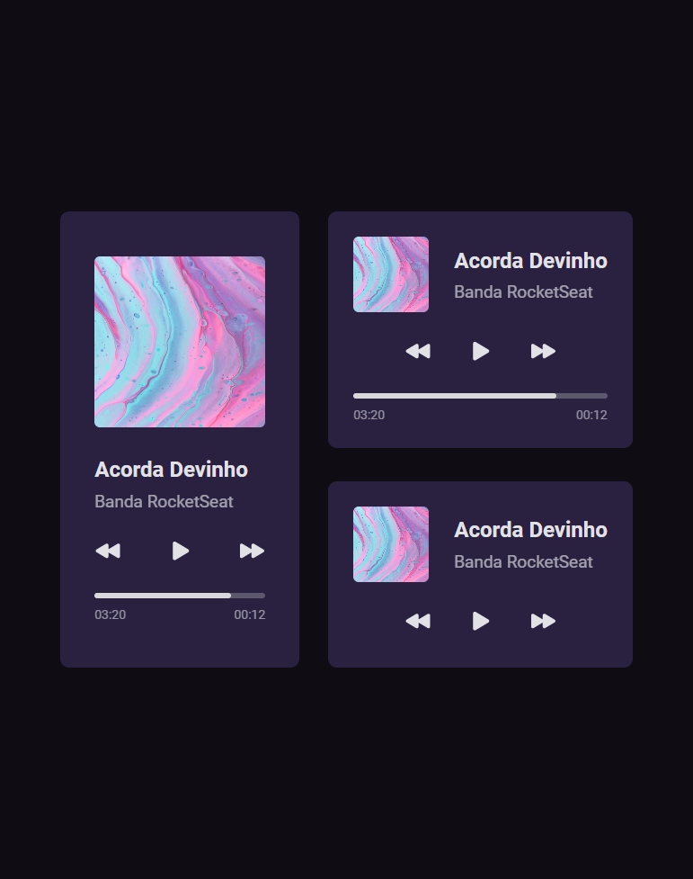
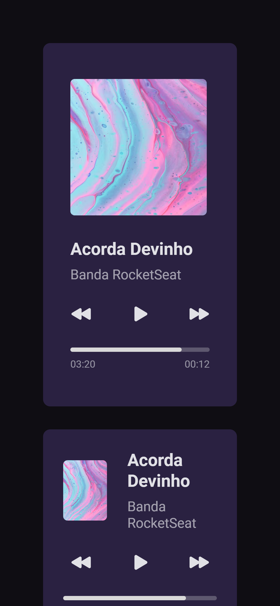

<h1 align="center">
    Music Player
</h1>

  <a href="#rocket-tecnologias">Technologies</a>&nbsp;&nbsp;&nbsp;|&nbsp;&nbsp;&nbsp;
  <a href="#-projeto">Project</a>&nbsp;&nbsp;&nbsp;|&nbsp;&nbsp;&nbsp;
  <a href="#-layout">Layout</a>&nbsp;&nbsp;&nbsp;|&nbsp;&nbsp;&nbsp;

 

  <strong>Desktop</strong>

  

  
  <strong>Mobile</strong> 
  

## 🚀 Technologies

This project was developed using the following technologies:

- [HTML](https://www.w3schools.com/html/)
- [CSS](https://www.w3schools.com/css/)

## 💻 Project

Music Player app it's an interface for a music player.

## 🔖 Layout

You can view the project layout trought [this link](<https://www.figma.com/file/ntNu24nfRRaQQxQh4avsOX/%23boraCodar---Desafio-01?node-id=0%3A1&t=w1WWcI7UhaogC1rQ-0>). Remembering that you need to have a [Figma](http://figma.com/) acount to access it.

---

Made with ♥ by John :wave: [Join the Rocketseat community!](https://discordapp.com/invite/gCRAFhc)
